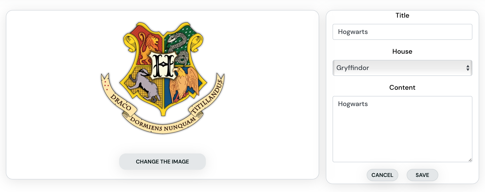
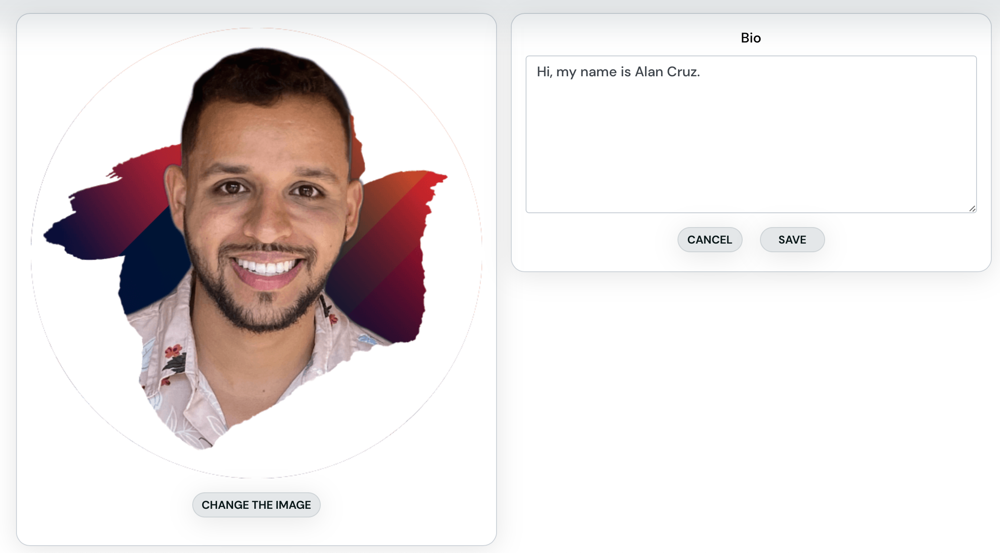
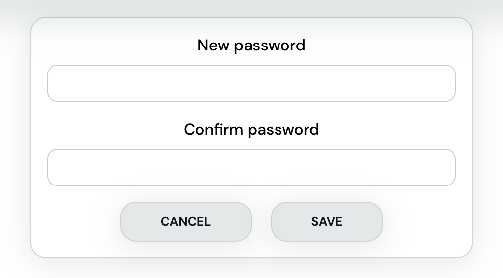

# Hogwarts

Hogwarts is a social media platform that has been created based on the beloved Harry Potter saga. The main objective of this platform is to enable users to view posts that are related to the saga. Users who have registered on the platform are able to list posts and access the content that is contained within them.

Only registered users can create, update, and delete posts. Registered users can follow, like, and comment on posts. A user's profile can be viewed by other users and visitors. Profile update functionality is restricted to the profile owner. The CRUD functionality for Likes, Followers, Contacts and Comments is restricted to the respective user."

This is my 5th portfolio project developed as part of the [Code Institute Diploma in Full Stack Development](https://codeinstitute.net/ie/full-stack-software-development-diploma/). It was created to demonstrate skills acquired using the [Django REST Framework](https://www.django-rest-framework.org/) and [React](https://react.dev/) JavaScript library to develop the API and Frontend respectively.


## Demo

[Frontend - Deployment](https://hogwarts-hf.herokuapp.com/)

### API Project Links

- [API - Repository](https://github.com/llancruzz/hogwarts-api)
- [API - Deployment](https://hogwarts-hp.herokuapp.com/)

## Table of Contents

- [User Experience (UX)](#user-experience-ux)
  - [User Stories](#user-stories)
  - [Agile Methodology](#agile-methodology)
  - [Design](#design)
    - [Wireframes](#wireframes)
    - [Color Scheme](#color-scheme)
    - [Typography](#typography)
    - [Images and Iconography](#images-and-iconography)
- [Features](#features)
  - [Home Page](#home-page)
  - [Navigation](#navigation)
  - [Register (Sign up) / Login](#register-sign-up--login)
  - [Post Creation / Edit Form](#post-creation--edit-form)
  - [Post List View and Search Bar](#post-list-view-and-search-bar)
  - [Post Detail View](#post-detail-view)
  - [Comment List View](#comment-list-view)
  - [Comment Detail View](#comment-detail-view)
  - [Feed](#feed)
  - [Liked](#liked)
  - [Most Followed Users](#most-followed-users)
  - [Profile](#profile)
  - [Profile Edit Form](#profile-edit-form)
  - [Username and Password Edit Forms](#username-and-password-edit-forms)
  - [Contact](#contact)
  - [House Profile](#house-profile)
  - [Icons](#icons)
  - [Not Found and Results Page](#not-found-and-results-page)
  - [Components](#components)
    - [Components used in this application](#components-used-in-this-application)
  - [Future Features](#future-features)
- [Testing](#testing)
  - [Bugs](#bugs)
    - [Fixed Bugs](#fixed-bugs)
    - [Remaining Bugs](#remaining-bugs)
- [Technologies Used](#technologies-used)
  - [Languages and Frameworks Used](#languages-and-frameworks-used)
  - [Node Packages / Dependencies Used](#node-packages--dependencies-used)
  - [Programs and Tools Used](#programs-and-tools-used)
- [Deployment](#deployment)
  - [Forking the GitHub Repository](#forking-the-github-repository)
  - [Making a Local Clone](#making-a-local-clone)
  - [Deploying with Heroku](#deploying-with-heroku)
  - [Linking with the API/backend](#linking-with-the-apibackend)
- [Credits](#credits)
  - [Code](#code)
  - [Media](#media)
  - [Acknowledgments](#acknowledgments)

## User Experience (UX)

The initial aims of the project, which formed the basis for user story creation, were to produce a web application that allows registered users to post their images, content and chose its house class of Hogwarts, and search for posts by other users for knowing each other. Key goals for the site were identified below and used to construct user stories:

- Allow users to search for posts using a filter.
- Allow posts to be liked for future review.
- Allow popular sellers to be followed so new listings can be seen via a newsfeed.
- Registered users can leave comments on posts.
- Site Owners can create/edit/delete their posts.
- Registered users can read and comment on another user's posts.
- Registered and unregistered users can contact the admin of the site for future issues on the web application.

### User Stories

All User Stories can be viewed in the project GitHub Repository and have been mapped to Epics on the projects [Kanban board](https://github.com/users/llancruzz/projects/10).
Acceptance criteria for each user story can be viewed by opening each User Story on the projects Kanban Board (linked above) or from the table view [here](https://github.com/users/llancruzz/projects/10/views/10). Alternatively, all User Stories can be found in a separate readme file [here](USERSTORIES.md).

### Agile Methodology

An Agile Methodology was employed to manage the development of this project. GitHub Projects was used to create User Stories as Issues, each with acceptance criteria and tasks. User Stories were then grouped into Milestones to represent the Epics each belongs to and assigned a priority using the MOSCOW prioritization technique.

User Stories were then assigned to 1 of the 4 planned Sprints (or Iterations) to cover the main development phase of the project. The project's Kanban board can be viewed [here](https://github.com/users/llancruzz/projects/10).

Pull requests were linked with a user story when they contributed to the completion of the acceptance criteria.

### Design

#### Wireframes

Wireframes were created to visualize the layout of the site and as a reference when translating those designs to the final product. Care was taken at this stage to consider a layout that would work well across a diverse range of viewports. Desktop and Mobile wireframes can be viewed using the button below:

<details><summary>Wireframes for Home Page Authorized</summary>
Home Page Authorized:


</details>
<details><summary>Wireframes for Home Page Unauthorized</summary>
Home Page Unauthorized:


</details>
<details><summary>Wireframes for Create Post Page</summary>
Create Post Page Authorized:


</details>
<details><summary>Wireframes for Comment on a Post Page</summary>
Comment on a Post Page:


</details>
<details><summary>Wireframes for Profile Page</summary>
Profile Page Authorized: 3 Dots means:  EDIT | Profile | Username | Password


</details>
<details><summary>Wireframes for Contact Page</summary>
Contact Page Authorized:


</details>
<details><summary>Wireframes for House Profile</summary>
House Profile Authorized:


</details>
<details><summary>Wireframes for Not Found / Not Results Page</summary>
Not Found | Not Results Page:


</details>
<details><summary>Wireframes for Sign In Page</summary>
Sign In Page:


</details>
<details><summary>Wireframes for Sign Up Page</summary>
Sign Up Page:


</details>

#### Color Scheme

The site's colour scheme was intentionally kept to a minimum to ensure clear focus, emphasize status information, and convey a professional aesthetic.


#### Typography

Google fonts were used in this project with both fonts selected for their legibility and simplicity:

1. [Link the font used here](https://fonts.google.com/specimen/DM+Sans)

#### Images and Iconography

The site logo was sourced from [PNGEGG](https://www.pngegg.com/). Please refer to the [Credits section](#credits) for more detail.

## Features

### Home Page

- The home page serves as the entry point for the site.
- It contains the navigation bar, a list of posts, the most followed profiles and the search bar post so users can interact with site content straight away.
- User Stories: [#17](https://github.com/llancruzz/hogwarts/issues/17) | [#19](https://github.com/llancruzz/hogwarts/issues/19) | [#24](https://github.com/llancruzz/hogwarts/issues/24)


### Navigation

- The navigation bar features on all pages of the site. It contains icons on each section of the web application.
- It was designed to be responsive and displays different links to users based on the authentication state.
  - If a user is authenticated, they can see links to create a post listing, view liked (like) posts, view their post feed (posts listed by other users they have followed), a contact form, all the houses profiles and a link to their profile and the option to sign out.
  - If a user is not authenticated, they can see links to log in or register (sign up). They can also see the home page, however, they can not have all CRUD functionality.
- When viewed on a smaller viewport all options are listed in a hamburger menu on the left of the navbar.
- User Stories: [#9](https://github.com/llancruzz/hogwarts/issues/9) | [#10](https://github.com/llancruzz/hogwarts/issues/10) | [#15](https://github.com/llancruzz/hogwarts/issues/15)


### Register (Sign up) / Login

- Users can register for an account that enables them to create posts, as well as like, comment on, and follow the profiles of other users.
- To ensure the accuracy of the chosen password, it is required that a unique username be provided along with it. Additionally, the password must be entered twice to minimize the possibility of any inadvertent errors.
- Upon completion of the register, the user will be redirected to the login page, where they can utilize their newly created credentials to authenticate their account.
- User Stories: [#11](https://github.com/llancruzz/hogwarts/issues/11) | [#12](https://github.com/llancruzz/hogwarts/issues/12) | [#13](https://github.com/llancruzz/hogwarts/issues/13) | [#14](https://github.com/llancruzz/hogwarts/issues/14)


### Post Creation / Edit Form

- Registered users are granted access to create posts and share them with the world.
- This form serves a dual purpose: it can be used both for creating a new post and for editing an existing one. an existing post.
- Users registered can upload an image to represent their post listing and choose from options of categories to display their post. The form comprises a title and a content section as well.
- To post their content, users must provide an image, a title, and the content itself.
- User Stories : [#16](https://github.com/llancruzz/hogwarts/issues/16) | [#25](https://github.com/llancruzz/hogwarts/issues/25)


### Post List View and Search Bar
- Users can filter posts according to their chosen category when the post was created. This feature enables users to easily find the content that is most relevant and interesting to them.
- Users can search for posts through a search bar using a keyword for the name of the post or the name of the user profile.
- User Stories: [#19](https://github.com/llancruzz/hogwarts/issues/19) | [#20](https://github.com/llancruzz/hogwarts/issues/20) | [#22](https://github.com/llancruzz/hogwarts/issues/22) | [#23](https://github.com/llancruzz/hogwarts/issues/23)


### Post Detail View
- The post details view comprises the post's title, image, content, the selected House, as well as buttons for liking and commenting on the post.
- It also displays the profile avatar, the date the post was created, and a dropdown menu to edit the post. 
- Registered users  have the ability to edit their posts by making changes to the image, content, title, and by selecting a different category for their post.
- Further details regarding each view will be explained below.
- User Stories: [#25](https://github.com/llancruzz/hogwarts/issues/25) | [#24](https://github.com/llancruzz/hogwarts/issues/24) | [#26](https://github.com/llancruzz/hogwarts/issues/26)



### Comment List View

- Registered users can leave comments on individual posts, even on their posts.
- The comment list view form includes the user's avatar, username, and the date the comment was posted.
- If a post has no comments, a message will be displayed, inviting users to leave the first comment on the post. 
- User Stories: [#26](https://github.com/llancruzz/hogwarts/issues/26) | [#27](https://github.com/llancruzz/hogwarts/issues/27) | [#28](https://github.com/llancruzz/hogwarts/issues/28)


### Comment Detail View

- Registered users can edit their comments by making changes to the content of their previous comments.
- User Stories: [#29](https://github.com/llancruzz/hogwarts/issues/29) | [#30](https://github.com/llancruzz/hogwarts/issues/30)


### Feed


- By allowing users to follow other users, the website's Feed section will display posts exclusively from authors whom the user has chosen to follow.
- User Stories: [#22](https://github.com/llancruzz/hogwarts/issues/22) | [#34](https://github.com/llancruzz/hogwarts/issues/34) | [#35](https://github.com/llancruzz/hogwarts/issues/35)

### Liked


- Users can like posts they enjoy, which directly impacts the "Liked" section of the website, displaying only the posts that the user has previously liked.
- User Stories: [#18](https://github.com/llancruzz/hogwarts/issues/18) | [#21](https://github.com/llancruzz/hogwarts/issues/21)

### Most Followed Users
- Users can easily view the most followed profiles, which include the avatar and username of each user. 
- The component also displays follow and unfollow buttons.
- User Stories: [#22](https://github.com/llancruzz/hogwarts/issues/22) | [#32](https://github.com/llancruzz/hogwarts/issues/32)


### Profile
- When users visit this section, they can view their statistics, such as:
  -  The number of posts they have created.
  -  The number of followers they have.
  -  The number of people they follow.
- Additionally, there is a small bio section where users can enter a quick description of themselves.
- Clicking on the three dots opens a dropdown menu with options to edit the user's profile, change their username, or change their password.
- User Stories: [#31](https://github.com/llancruzz/hogwarts/issues/31) | [#33](https://github.com/llancruzz/hogwarts/issues/33) | [#34](https://github.com/llancruzz/hogwarts/issues/34)


### Profile Edit Form

- Registered users can edit their profile by updating their profile picture and bio.
- User Stories: [#36](https://github.com/llancruzz/hogwarts/issues/36)



### Username and Password Edit Forms

- Registered users can update their username and password by editing their account information.
- User Stories: [#37](https://github.com/llancruzz/hogwarts/issues/37)




### Contact

- Registered users can contact the web application administrator by submitting a contact form.
- The user must provide a reason for contacting the administrator through the contact form. If they have any additional information, they can enter it in the details field.
- User Stories: [#38](https://github.com/llancruzz/hogwarts/issues/38)


### House Profile

- When users click on the description button of each house, a brief description or biography of the house appears. This allows users to learn more about each house in the Harry Potter world and their unique characteristics.
- This section displays the point totals for each of the four Hogwarts houses. Points are awarded based on the number of likes that posts related to each house receive. For instance, if a post related to House 1 receives 10 likes, House 1 will have 10 points, and so on for the other houses.
- User Stories: [#40](https://github.com/llancruzz/hogwarts/issues/40)


### Icons
- Using icons on your project can be beneficial in several ways:
  - Ease of Use: Icons can make your project more user-friendly by providing visual cues for users.
  - Visual Appeal: Icons can enhance the visual appeal of your project and make it more engaging for users.
  - Internationalization: Icons can also help to overcome language barriers. Since icons are visual, they can be understood by people from different countries who may not speak the same language.
- All the icons used in this project were added through the website [Font Awesome](https://fontawesome.com/)


### Not Found and Results Page

- All page not found displays a message:
  - Sorry, the page you're looking for doesn't exist
- All page with no results of posts, feed, or likes displays a message:
  - No results found. Adjust the search keyword or like a post.
  - No results found. Adjust the search keyword or follow a user.
  - No results found, the user hasn't posted yet.


### Components

Components in ReactJS are independent and reusable blocks of code that simplify developments by allowing a developer to break a user interface into elements that can be reused across one or multiple applications.

For more details about Component, check the repository that I have created throughout Code Institute by clicking in:
[Components](https://github.com/llancruzz/react-components)

Several components-entse created during the development of this project and are highlighted below. Benefits common to all components are 

- Ease of development by consolidating code into a single re-usable component that could be used in different parts of the application and debugging by modifying code in a single location.
- Allowed for consistent user experience across pages without code duplication and the complexities of managing duplicated code.

#### Components used in this application

- Asset
  - Used to display a loading spinner, upload image (planned to be used when multiple image uploads are introduced to the site in future versions) and a message when search filters returned no results.
  - UX (user experience) is improved by the loading spinner as users are notified when content is being fetched by the application, rather than being presented with a blank or partially complete page while data is loaded.
  - UX is improved by the feedback provided to users when a search returns no results as this provides feedback and prompts them to adjust their search criteria.

- Profile Picture
  - Used to display the user avatar in different variations throughout the site (based on use and viewport size).
  - UX experience is improved as users can quickly identify the author of posts and their authentication state.

- More Actions Dropdown
  - This component was used on the profile, post detail and comment components to present options for object editing and deletion.
  - UX was improved by presenting a consistent menu throughout the site while allowing for different functionality by passing handler functions as arguments (props) to the component.

- NavBar
  - The navigation bar appears on every page and contributes to an improved user experience by providing users with to access the majority of site functionality consistently.
  - The Navbar component displays different links and layouts based on the authentication state and as such contains a lot of conditional logic. Not having to duplicate this code across each page and having a reusable component saved time and effort during the development cycle.

- NotFound
  - This component is displayed when a user navigates to a resource that doesn't exist.
  - It improves the user experience by providing feedback when an error has occurred and allowing the NavBar to remain accessible so they can continue to use the site.

### Future Features

- Lorem Ipsum

## Testing

Separate testing documentation can be viewed [here](TESTING.md).

### Bugs

#### Fixed Bugs
- Lorem Ipsum

#### Remaining Bugs
- To utilize the Hogwarts web app on iOS devices, Safari on MacOS, Samsung Internet on Samsung devices, and potentially other platforms, users must disable their anti-tracking features such as 'Prevent Cross-Site Tracking' on Apple devices or 'Smart Anti-Tracking' on Samsung devices. This is necessary because the web app's Django Rest Framework API and React front-end are hosted on separate domains through Heroku, thereby triggering the anti-tracking mechanisms which obstruct cross-domain requests from the front end to the API. Unfortunately, it appears that there is no solution available other than hosting the API and front end on the same domain. (reference - https://stackoverflow.com/questions/56972162/is-there-a-workaround-for-safari-ios-prevent-cross-site-tracking-option-when).

No known remaining bugs.

## Technologies Used

### Languages and Frameworks Used

- [HTML](https://en.wikipedia.org/wiki/HTML)
- [CSS](https://en.wikipedia.org/wiki/CSS)
- [Javascript](https://en.wikipedia.org/wiki/JavaScript)
- [React - JavaScript library](https://react.dev/)

### Node Packages / Dependencies Used

- [React Bootstrap](https://react-bootstrap.github.io/) - Component-based library that provides native Bootstrap components as pure React components. Used to create a responsive application/component UI.
- [Axios](https://axios-http.com/) - Promise based HTTP client for the browser and node.js. Used to make HTTP requests from throughout the application.
- [jwt-decode](https://github.com/auth0/jwt-decode) - Used to decode and extract information from a JWT token.
- react-router-dom - Routing library for the React Javascript library. Used to display different components based on the URL entered in the browser.
- [react-google-maps/api](https://react-google-maps-api-docs.netlify.app/) - Provides bindings to the Google Maps JavaScript API (v3) and lets it be used in applications as React components. Used to display a map of the local area on the property page.
- [react-infinite-scroll-component](https://github.com/ankeetmaini/react-infinite-scroll-component) - Component which manages the loading of paginated content. Used to automatically load more content as the user browses site content.
- [react-textarea-autosize](https://github.com/Andarist/react-textarea-autosize) - A replacement for the textarea component that automatically resizes. Used to improve the user experience as they create notes.

### Programs and Tools Used

- [dbdiagram](https://dbdiagram.io/home) - Create Database Schema/Entity-Relationship Diagrams
- [Gitpod:](https://code.visualstudio.com/)
  - Visual Studio Code was used as my code editor for this project. A full list
    of plugins used can be found later in this section.
- [Git](https://git-scm.com/)
  - Git was used for version control, using the terminal to commit to Git and
    Push to GitHub.
- [GitHub:](https://github.com/)
  - GitHub is used to store the project's code after being pushed from Git.
- The following modules were installed or enabled in [Gitpod](https://code.visualstudio.com/) to assist with formatting and code linting:
  - [ESLint](https://eslint.org/) - Code Linter.
  - [Prettier](https://prettier.io/) - Code Formatting.


## Deployment

### Forking the GitHub Repository

By forking the GitHub Repository we make a copy of the original repository on
our GitHub account to view and/or make changes without affecting the original
repository by using the following steps...

1. Log in to GitHub and locate the [GitHub
   Repository](https://github.com/ianmeigh/property-direct-backend)
1. At the top of the Repository (not the top of page) just above the "Settings"
   Button on the menu, locate the "Fork" Button.
1. Click the button (not the number to the right) and you should now have a copy
   of the original repository in your GitHub account.

### Making a Local Clone

**NOTE**: It is a requirement of the project that you have Python version 3.8 or higher installed locally.

1. Log in to GitHub and locate the [GitHub Repository](https://github.com/llancruzz/hogwarts-api).
1. Under the repository name, click "Code".
1. To clone the repository using HTTPS, under "HTTPS", copy the link.
1. Open your local terminal with git installed
1. Change the current working directory to the location where you want the cloned directory to be created.
1. Type `git clone`, and then paste the URL you copied in Step 3.

    ```console
    ~$ git clone https://github.com/llancruzz/hogwarts-api.git
    ```

1. Press Enter. Your local clone will be created.

    ```console
    $ git clone https://github.com/llancruzz/hogwarts-api.git
    > Cloning into `test-dir`...
    > remote: Counting objects: 10, done.
    > remote: Compressing objects: 100% (8/8), done.
    > remove: Total 10 (delta 1), reused 10 (delta 1)
    > Unpacking objects: 100% (10/10), done.
    ```

    [Click here](https://help.github.com/en/github/creating-cloning-and-archiving-repositories/cloning-a-repository#cloning-a-repository-to-github-desktop) for a more detailed explanation of the process above with pictures.

1. Change the current working directory to the cloned project folder (this will be a child directory in the location you cloned the project).

1. This guide assumes you have Node.js and npm installed locally, if this is not the case please install these now.
1. From the terminal run the command `npm install` to install all project dependencies.
1. Run the command `npm start` to run the application.

### Deploying with Heroku

**NOTE**: It is a prerequisite of deployment to Heroku that you already have access to the following:

**NOTE**: It is assumed you have followed all deployment instructions listed in this readme starting with the section titled 'Forking the GitHub Repository'.

1. Log in to [Heroku](https://www.heroku.com/) and if not taken there automatically, navigate to your personal app dashboard.
2. At the top of the page locate the 'New' drop down, click it and then select 'Create new app'.
3. Give your application a unique name, select a region appropriate to your location and click the 'Create app' button.
4. Your app should now be created. From the menu towards the top of the page select the 'Settings' section and click 'Reveal Config Vars' in the Config vars section. Enter the following key / value pairings:
5. Navigate to the 'Deploy' page using the menu towards the top of the page.
6. Select 'GitHub' from the 'Deployment method' section and you will be prompted to 'Connect to GitHub'.
7. Once connected to your GitHub account you will be able to search for your repository which contains the forked 'Support-Hub' repository.
8. Once the repository is found click 'Connect'.
9. At the bottom of the page find the section named 'Manual deploy', select the 'main' branch in the drop-down and click the 'Deploy' button.
10. Once deployment is complete, click the 'View' button to load the URL of the deployed application.

### Linking with the API/backend

You will need to ensure ydrop-downet the `axios.defaults.baseURL` in the `api/axiosDefaults.jsx` file to the URL of your deployed version of the API.
You should then update the `CLIENT_ORIGIN` config variable in your deployed version of the API to ensure you will be able to make authenticated requests to this API.

## Credits

### Code

- The Moments tutorial produced by Code Institute is credited throughout this project as it was used to create the foundations upon which I built upon to create my project.
- [React documentation](https://reactjs.org/docs/getting-started.html) - Was used throughout development to gain a better understanding of Hooks.
- [React Bootstrap documentation and examples](https://react-bootstrap.github.io/components/alerts) - Used as a reference when building responsive component layouts.

### Media

- Post Images for demo post content and users' avatars were taken from [unsplash](https://unsplash.com/) and [iStock](https://www.istockphoto.com/).

### Acknowledgments

As always a huge thank you to my partner for his patience and support throughout this project.
