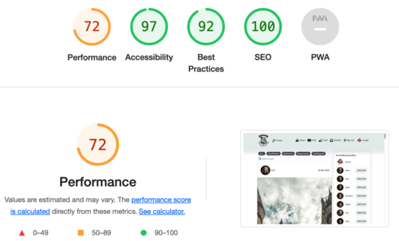
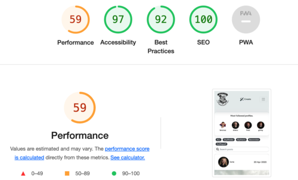

# Testing

## Table of Contents:

- [User Story Testing](#user-story-testing)
  - [Navigation](#navigation)
  - [Authentication](#authentication)
  - [Adding & Liking Posts](#adding-&-liking-posts)
  - [The Posts Page](#the-posts-page)
  - [The Post Page](#the-post-page)
  - [The Profile Page](#the-profile-page)
  - [Contact](#contact)
  - [House Profile](#house-profile)
- [Code Validation](#code-validation)
  - [JSX](#jsx)
  - [CSS](#css)
  - [Lighthouse Scores](#lighthouse-scores)

## User Story Testing

These tests were carried out when a feature was completed and committed during development. They have also been carried out against the deployed version of the site, the results of which are displayed below.

In addition to the test detailed below, all site URLs were tested to ensure they took users to the correct page.

### Navigation

#### User Story [#9](https://github.com/llancruzz/hogwarts/issues/9) | [#10](https://github.com/llancruzz/hogwarts/issues/10) | [#15](https://github.com/llancruzz/hogwarts/issues/15)

- As a **user** I can **view a navbar from every page** so that **I can navigate easily between pages**.
- As a **user** I can **navigate through pages quickly** so that **I can view content seamlessly without page refresh**.
- As a **logged out user** I can **see sign in and sign up options** so that **I can sign in/sign up**.

| Test # | Test | Outcome | Result |
|---|---|---|---|
| 1 | The navigation bar ought to be prominently displayed on each page and provide users with clear indication of their current position within the site's hierarchical structure. | The navigation bar is situated at the top of every page for easy accessibility. | PASS |
| 2 | The navigation bar should adjust its layout to fit the screen size of the device it is being viewed on. | The navigation bar is designed to be responsive and adapt to different viewport sizes, ensuring optimal functionality across various devices. | PASS |
| 3 | All links are verified to be precise and effectively direct users to their intended resources. | There are no broken links, and all links direct users to the expected URLs. | PASS |
| 4 | Unauthorized users can only view the "Sign In" and "Sign Up" links on the navigation bar. | Unauthorized users do not have CRUD functionality. | PASS |

### Authentication

#### User Story [#11](https://github.com/llancruzz/hogwarts/issues/11) | [#12](https://github.com/llancruzz/hogwarts/issues/) | [#13](https://github.com/llancruzz/hogwarts/issues/13) | [#14](https://github.com/llancruzz/hogwarts/issues/14)

- As a **user** I can **create a new account** so that **I can access all the features for signed up users**.
- As a **user** I can **sign in to the app** so that **I can access functionality for logged in users**.
- As a **user** I can **tell if I am logged in or not** so that **I can log in if I need to**.
- As a **user** I can **maintain my logged-in status until I choose to log out** so that **my user experience is not compromised**.

| Test # | Test | Outcome | Result |
|---|---|---|---|
| 1 | Users are able to register by providing a unique username and password. | Confirmed username must be unique, confirmed password must be match | PASS |
| 2 | Click on the "Sign In" button to submit the credentials. | Upon successful login, users will be redirected to the home page where they can access additional features and functionalities. | PASS |
| 3 | Look for any indication of the user's login status, such as a "Sign Out" button or a user profile icon. | If the user is not logged in and the app redirects the user to the sign in page. | PASS |
| 4 | Close the app or the tab/browser without logging out. | Users can remain logged in for a period exceeding 12 hours. | PASS |

### Adding & Liking Posts

#### User Story [#16](https://github.com/llancruzz/hogwarts/issues/16) | [#17](https://github.com/llancruzz/hogwarts/issues/17) | [#18](https://github.com/llancruzz/hogwarts/issues/18)

- As a **logged in user** I can **create posts** so that **I can share my images with the world!**
- As a **user** I can **view the details of a single post** so that **I can learn more about it**.
- As a **logged in user** I can **like a post** so that **I can show my support for the posts that interest me**.

| Test # | Test | Outcome | Result |
|---|---|---|---|
| 1 | Click on the "Create" icon, enter the necessary information for the post, such as title, image, houses category and content fields. | The post appears on the user's profile | PASS |
| 2 | Click on the post to view its details. | Post details are displayed with its details and date/time posted. | PASS |
| 3 | Click on the "Like" button for the post. | The "Like" count for the post increases by 1. | PASS |
| 4 |  The user can not like its own post. | If a user attempts to like their own post, a message alert will be displayed informing them that this action is not permitted. | PASS |

### The Posts Page

#### User Story [#19](https://github.com/llancruzz/hogwarts/issues/19) | [#20](https://github.com/llancruzz/hogwarts/issues/20) | [#21](https://github.com/llancruzz/hogwarts/issues/21) | [#22](https://github.com/llancruzz/hogwarts/issues/22) | [#23](https://github.com/llancruzz/hogwarts/issues/23)

- As a **user** I can **view all the most recent posts, ordered by most recently created first** so that **I am up to date with the newest content**.
- As a **user**, I can **search for posts with keywords**, so that **I can find the posts and user profiles I am most interested in**.
- As a **logged in user** I can **view the posts I liked** so that **I can find the posts I enjoy the most**.
- As a **logged in user** I can **view content filtered by users I follow** so that **I can keep up to date with what they are posting about**.
- As a **user** I can **keep scrolling through the images on the site, that are loaded for me automatically** so that **I don't have to click on "next page" etc**.

| Test # | Test | Outcome | Result |
|---|---|---|---|
| 1 | Scroll down the feed to view additional posts. |  Posts are displayed in descending order of creation date. | PASS |
| 2 | Navigate to the search bar on the app, enter a keyword related to the post or user. | Search results display the relevant posts or user profiles and the user is redirected to the relevant page after clicking on a search result. | PASS |
| 3 | Click on the "Liked" icon on navbar. | The posts the user has liked are displayed in descending order of creation date. | PASS |
| 4 | Users have the ability to follow other users' profiles, enabling them to receive updates and notifications regarding their activities. |  When a user follows another profile, they will be able to view the posts made by that profile in their feed. This functionality is visible to all users who are following the profile.| PASS |
| 5 | Scroll down to the end of the first set of posts. | More posts are loaded automatically without the user having to click on a "next page" button or similar. | PASS |

### The Post Page

#### User Story [#24](https://github.com/llancruzz/hogwarts/issues/24) | [#25](https://github.com/llancruzz/hogwarts/issues/25) | [#26](https://github.com/llancruzz/hogwarts/issues/26) | [#27](https://github.com/llancruzz/hogwarts/issues/27) | [#28](https://github.com/llancruzz/hogwarts/issues/28) | [#29](https://github.com/llancruzz/hogwarts/issues/29) [#30](https://github.com/llancruzz/hogwarts/issues/30)

- As a **user** I can **view the posts page** so that **I can read the comments about the post**.
- As a **post owner** I can **edit my post title and description** so that **I can make corrections or update my post after it was created**.
- As a **logged in user** I can **add comments to a post** so that **I can share my thoughts about the post**.
- As a **user** I can **see how long ago a comment was made** so that **I know how old a comment is**.
- As a **user** I can **read comments on posts** so that **I can read what other users think about the posts**.
- As an **owner of a comment** I can **delete my comment** so that **I can control removal of my comment from the application**.
- As an **owner of a comment** I can **edit my comment** so that **I can fix or update my existing comment**.

| Test # | Test | Outcome | Result |
|---|---|---|---|
| 1 | Click on a post from the list of posts displayed on the page. | Posts details are displayed and the comments related to the post are displayed | PASS |
| 2 | Click on the "Edit" button. | The updated post title, house, content and image are saved and displayed. | PASS |
| 3 | Click on the "Leave a comment" and click on "post" button. | The comment is added to the post and displayed after the user clicks on the "Post" button | PASS |
| 4 | Check if there is a timestamp associated with each comment indicating when the comment was made. | The comments are displayed along with their corresponding timestamps. | PASS |
| 5 | Scroll down to the comments section. |The comments related to the post are displayed. | PASS |
| 6 | Click on the delete button next to the comment. (DOTS) | The comment is successfully deleted and removed from the post. | PASS |
| 7 | Click on the edit button next to the comment. (DOTS) | The comment is successfully edited and updated with the new changes. | PASS |

### The Profile Page

#### User Story [#31](https://github.com/llancruzz/hogwarts/issues/31) | [#32](https://github.com/llancruzz/hogwarts/issues/32) | [#33](https://github.com/llancruzz/hogwarts/issues/33) | [#34](https://github.com/llancruzz/hogwarts/issues/34) | [#35](https://github.com/llancruzz/hogwarts/issues/35) | [#36](https://github.com/llancruzz/hogwarts/issues/36) [#37](https://github.com/llancruzz/hogwarts/issues/37)

- As a **user** I can **view other users profiles** so that **I can see their posts and learn more about them**.
- As a **user** I can **see a list of the most followed profiles** so that **I can see which profiles are popular**.
- As a **user** I can **view statistics about a specific user: bio, number of posts, follows and users followed** so that **I can learn more about them**.
- As a **logged in user** I can **follow and unfollow other users** so that **I can see and remove posts by specific users in my posts feed**.
- As a **user** I can **view all the posts by a specific user** so that **I can catch up on their latest posts, or decide I want to follow them**.
- As a **logged in user** I can **edit my profile** so that **I can change my profile picture and bio**.
- As a **logged in user** I can **update my username and password** so that **I can change my display name and keep my profile secure**.

| Test # | Test | Outcome | Result |
|---|---|---|---|
| 1 | Click on the username of any user whose profile you want to view. | The user profile is successfully displayed and the user's posts are displayed on their profile page. | PASS |
| 2 | Observe a list of profiles is displayed on the page . | List of profiles is successfully displayed on the most followed profiles page and the profiles are ordered by number of followers, with the most followed profiles listed first. | PASS |
| 3 | Navigate to the profile of any user whose statistics you want to view. | The user's statistics are successfully displayed on their profile page and the statistics include their bio, number of posts, number of followers, and number of users they are following. | PASS |
| 4 | Navigate to the profile page of any user and click on the "follow" button or "unfollow". | The followed user is successfully added to the "Following" page after clicking on the "Follow" button and removed from the "Following" page after clicking on the "Unfollow" button. | PASS |
| 5 | Navigate back to the user's profile page. | All posts created by the user are displayed on the "Posts" page. | PASS |
| 6 | Click on the "Edit Profile" button.(DOTS) and update the profile picture and bio. | The updated profile picture and bio are displayed on the user profile page after clicking on the "Save" button | PASS |
| 7 | Click on the "Edit" button.(DOTS) "Change Username" and "Change Password. | The updated username and password are displayed on the account settings page after clicking on the "Save" button and the login is successful with the updated credentials. | PASS |

### Contact

#### User Story [#38](https://github.com/llancruzz/hogwarts/issues/38)

- As a **user**, I can **contact the admin of the website** so that **I can report any issues with the web application**.

| Test # | Test | Outcome | Result |
|---|---|---|---|
| 1 |Navigate to the "Contact" section of the web application. Fill out the contact form click the "Send" button. | A message appears after clicking the "Send" button, indicating thanks for getting in touch. | PASS |
| 2 | The form cannot be left blank; users are required to fill it out before submitting. | If the form is submitted while empty, an error message will be displayed. | PASS |

### House Profile

#### User Story [#40](https://github.com/llancruzz/hogwarts/issues/40)

- As a **logged-in user**, I can **see and read about Hogwarts House classes**, so that **I can gain more knowledge about the history of each house in the world of witchcraft and wizardry at Hogwarts**.

| Test # | Test | Outcome | Result |
|---|---|---|---|
| 1 | Navigate to the "House" section of the web application and click on a "description" button. | Clicking on the "Description" button will display relevant details about each Hogwarts house. | PASS |
| 2 |  | | PASS |

## Code Validation

### JSX

All JSX code was validated during development and corrected as the project progressed.

- The default [Prettier](https://marketplace.visualstudio.com/items?itemName=esbenp.prettier-vscode) extension was utilized throughout the development process to validate the JSX code.

### CSS

The [W3C CSS Validator Service](https://jigsaw.w3.org/css-validator/#validate_by_input) was used to validate the project's custom CSS files to ensure there were no syntax errors.

| File | Result |
|---|---|
| [Asset.module.css](#) | PASS |
| [Button.module.css](#) | PASS |
| [Comment.module.css](#) | PASS |
| [CommentCreateEditForm.module.css](#) | PASS |
| [Houses.module.css](#) | PASS |
| [Image.module.css](#) | PASS |
| [MoreDropdown.module.css](#) | PASS |
| [NavBar.module.css](#) | PASS |
| [NotFound.module.css](#) | PASS |
| [PopularProfiles.module.css](#) | PASS |
| [Post.module.css](#) | PASS |
| [PostCreateEditForm.module.css](#) | PASS |
| [PostsPage.module.css](#) | PASS |
| [Profile.module.css](#) | PASS |
| [ProfileEdit.module.css](#) | PASS |
| [ProfilePage.module.css](#) | PASS |
| [ProfilePicture.module.css](#) | PASS |
| [SignInUpForm.module.css](#) | PASS |

### Lighthouse Scores

While the site received a favourable desktop usage score, its mobile performance was adversely affected by the quantity and formatting of the images employed. In response, I endeavoured to explore ways to deliver images in diverse formats and sizes using Cloudinary workflows for automated formatting of uploaded images. Unfortunately, due to time constraints, I was unable to implement this solution for the current iteration of the site.

- Main Page (Home Page | Post List) Desktop

- Main Page (Home Page | Post List) Mobile

Return to [README.md](README.md) :book: